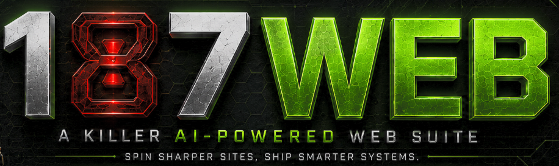
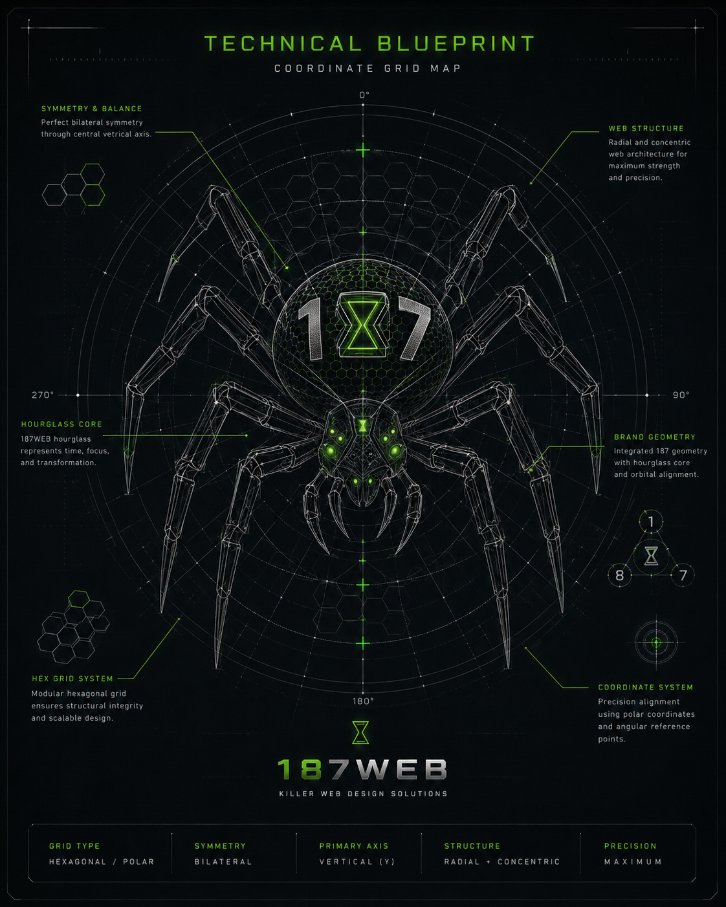

# 187WEB

<p align="center">
  
</p>

<p align="center">
  
</p>

<p align="center">
  
  &nbsp;&nbsp;
  
</p>

<h3 align="center">A killer AI-powered web suite.</h3>

<p align="center">A command-driven AI web suite that turns intent into research-grade pages, design systems, and docs.</p>

<p align="center">
  <a href="https://lumenhelixlab.github.io/187WEB/">Launch Page</a>
  <span> · </span>
  <a href="https://github.com/LumenHelixLab/187WEB">GitHub</a>
  <span> · </span>
  <a href="https://lumenhelix.com">LumenHelix</a>
</p>

<details>
<summary>NATASHA technical blueprint (mascot geometry)</summary>
<p align="center">
  
</p>
</details>

---

187WEB is a Next.js, React, TypeScript, and Tailwind CSS ecosystem that exposes a short slash-command grammar — /187 craft, /187 seo, /187 launch, /187 research, and more — turning intent into finished public pages, component kits, docs, and research artifacts with built-in standards gates.

## Why 187WEB

- **Ship faster.** One command generates a landing page, component kit, doc set, or research artifact instead of wiring boilerplate.
- **Launch with standards.** SEO, accessibility, inclusion, revenue architecture, and publish gates are built into the workflow.
- **Own your stack.** Local-first, deterministic, and open-core — run offline, audit every change, and deploy anywhere.

## Quick start

### macOS / Linux

```bash
git clone https://github.com/lumenhelixlab/187WEB.git
cd 187WEB
npm install
npm run db:push
npm run db:seed
npm run dev
```

### Windows (PowerShell)

```powershell
git clone https://github.com/lumenhelixlab/187WEB.git
Set-Location 187WEB
npm install
npm run db:push
npm run db:seed
npm run dev
```

### Windows (Git Bash / WSL)

```bash
git clone https://github.com/lumenhelixlab/187WEB.git
cd 187WEB
npm install
npm run db:push
npm run db:seed
npm run dev
```

> Tested on Windows 11, macOS Sonoma, Ubuntu 22.04/24.04, and modern mobile browsers.

## Features

| Feature | What it gives you |
|---------|-------------------|
| Command palette web builder | Use /187 craft, /187 kit, /187 docs, and /187 write to generate pages, design systems, docs, and copy. |
| Standards-first launch gate | Run /187 seo, /187 access-plus, /187 include, /187 revenue, /187 launch, and /187 publish before going live. |
| Research-grade labs | Ship reproducible experiments, dataset cards, API contracts, benchmarks, and Research Release Packets via /187 research, /187 labs, /187 data, and /187 crate. |
| KNOTstore memory layer | Pluggable agentic memory with SQLite, KNOT-point, and hybrid backends, plus a Vault-style preview at /knotstore. |

## First-class skills

Public slash-command surfaces in the 187 suite:

| Domain | Skills |
|--------|--------|
| Build & ship | **187REPO**, **187CRAFT**, **187VIBE**, **187LAUNCH**, **187FREE** |
| Research & standards | **187RESEARCH**, **187SEO**, **187REVENUE**, **187DOCS** |
| Learn & access | **187LEARN**, **187TEST**, **187ACCESS+** |
| Release | **187VERSION**, **187PUBLISH** |
| NATASHA multi-agent | **187NATASHA**, **187QUANTUM**, **187CHAIN** |

Workflow support includes `/187 handoff` (`agentic-sprint-handoff`) for phased multi-agent coding handoffs. See [docs/NATASHA-AGENTIC-HANDOFFS.md](docs/NATASHA-AGENTIC-HANDOFFS.md).

## Architecture

```
187WEB/
├── app/                  Next.js App Router (pages, /187 explorer, install, knotstore)
├── components/187/       command palette and reference components
├── components/showcase/  ability cards, tabs, scenario demos
├── lib/                  skill data, knotstore agentic memory layer
├── docs/                 command, skills, install, research, standards
└── prisma/               SQLite schema, seed, and migrations
```

## Development

```bash
npm install
npm run db:push
npm run db:seed
npm run dev
```

## Roadmap

- [ ] Expand /187 skill packs for e-commerce and research lab templates
- [ ] Add one-command static export and GitHub Pages publish gate
- [ ] Integrate Obsidian vault sync for KNOTstore agent memory

## License

Released under a custom noncommercial license with reserved Knotstore IP. See LICENSE for full terms.

---

<p align="center">
  <sub>187WEB is a <a href="https://lumenhelix.com">LumenHelix</a> project — Applied Symbolic Dynamics & Reversible Computation.</sub>
</p>
